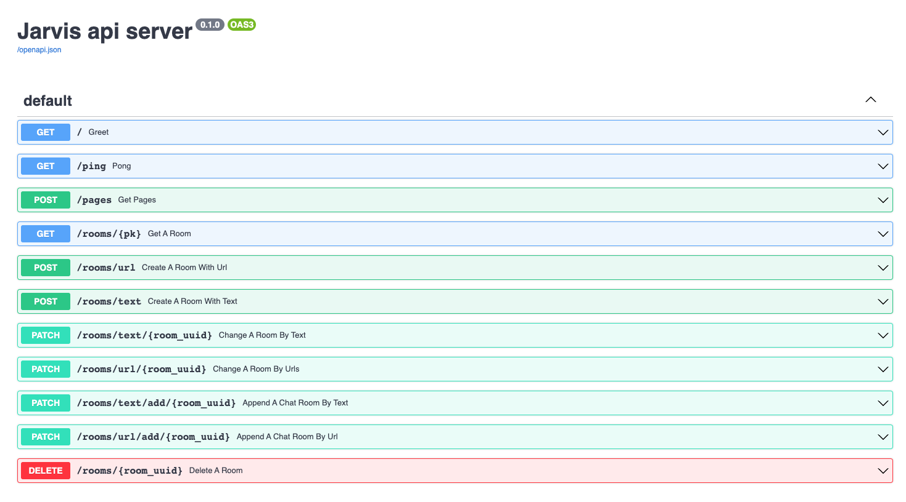
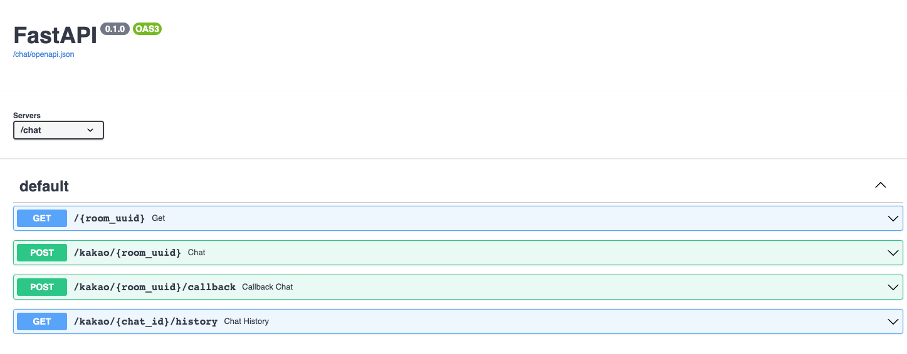
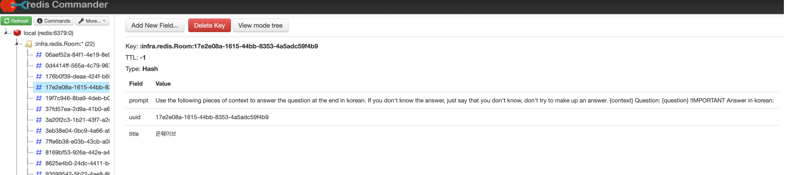
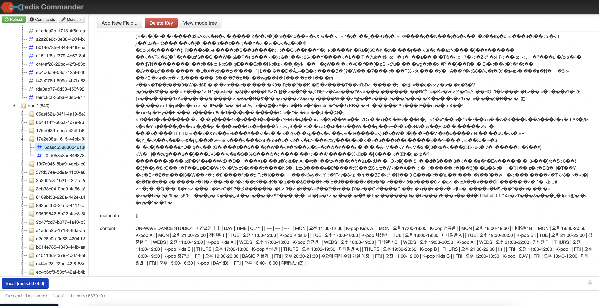
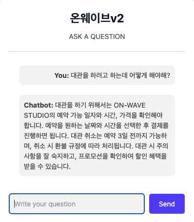
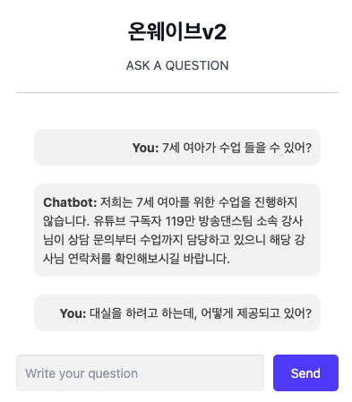

# `Jarvis` 

> Domain-Specific ChatGPT Platform.

## Overview
Jarvis is a cutting-edge platform that integrates ChatGPT with domain-specific knowledge. By vectorizing vast amounts of domain knowledge, Jarvis allows users to utilize GPT in context with domain-specific information. Furthermore, with the power of fine-tuning, Jarvis offers a more customized GPT experience tailored to the specific needs of its users.

## Stack
- Domain Knowledge Utilization: `Langchain` / `Openai`
- Vectorestore / Database: `Redis`
- WSS server / API server: `Fastapi` / `Nginx`
- For Report: [Report Jupyter Notebook Repo](https://github.com/minkj1992/jupyter-notebook-docker-compose/tree/main)


## Features
1. **Domain Knowledge Integration**: Jarvis transforms extensive domain knowledge into vectorstore, enabling GPT to operate within a specific domain context.
2. **Customizable GPT**: Through fine-tuning, users can have a GPT experience that is more aligned with their specific requirements.
3. **Chatbot Service**: Designed with use-cases such as onboarding part-time staff for solo entrepreneurs and facilitating conversations with book authors.
4. **Report Generation**: Using the user's chat conversation history as input, Jarvis allows users to select a topic of interest. It then provides an in-depth report, analyzing the topic across 3-4 subtopics.

## Services

1. **Chatbot**: Ideal for scenarios like assisting self-employed individuals in onboarding part-time workers or enabling conversations with book authors.

2. **Report Writing**: Users can input their existing chat conversation history, and upon selecting a desired topic, Jarvis will generate a comprehensive report, breaking down the topic into 3-4 detailed subtopics.
<div align='center'>

<h4>1. Swagger</h4>
<table width="100%" border="0">
  <tr>
    <td></td>
    <td></td>
  </tr>
</table>

<h4>2. Vectorstore redis</h4>
<table width="100%" border="0">
  <tr>
    <td></td>
    <td></td>
  </tr>
</table>

<h4>3. Use case</h4>
<table width="100%" border="0">
  <tr>
    <td></td>
    <td></td>
    <td></td>
  </tr>
</table>

</div>

## Init && Deploy

### Initialization

```sh
$ poetry init
$ poetry env use python3.8
$ poetry add langchain faiss-cpu
```

### Vscode

```sh
$ poetry config virtualenvs.in-project true
$ poetry config virtualenvs.path "./.venv"
```

### 🚀 Local Deploy

```sh
$ make up
```

### 🚀 Azure VM Deploy


```sh
$ make prod-down && make deploy

# ssh
$ make ssh
```


### 🚀 Google Cloud Deploy

1. **Preparation**:
   - Install `gcloud-cli`: [Official Installation Guide](https://cloud.google.com/sdk/docs/install?hl=en)
2. **VM Deployment**:
   - Execute the script to deploy the VM:
     ```sh
     $ ./gcp_vm.sh tidy-amplifier-387210 asia-northeast3-a e2-standard-4 jarvis-ins
     ```
3. **DNS & IP Configuration**:
   - Configure Google Cloud DNS and set a fixed IP:
     - [Google Cloud DNS Documentation](https://cloud.google.com/dns/docs/zones?hl=ko)
     - [Google IP Configuration](./docs/google-ip.png)
4. **Nameserver & IP Settings**:
   - to set the Nameserver and IP from [가비아](https://customer.gabia.com/manual/domain/286/991).
5. **VM Initialization**: `$ ./init_vm.sh`
6. **SSL Configuration**:
    - Modify `./data/nginx/app.conf` by commenting out the HTTPS section. This is essential for generating the `.pem` file using the `lets encrypt` script.
    - ⚠️ **Note**: If you skip this step, nginx might not find the SSL and won't run, leading to a [`connection refused error`](https://stackoverflow.com/questions/68449947/certbot-failing-acme-challenge-connection-refused).

7. **SSL Certificate Initialization**: `$ ./init-letsencrypt.sh`
8. **Revert SSL Configuration**:
    - Restore the original settings of `./data/nginx/app.conf`.
9. **Environment Setup & Deployment**: `$ vim .env && make deploy`
