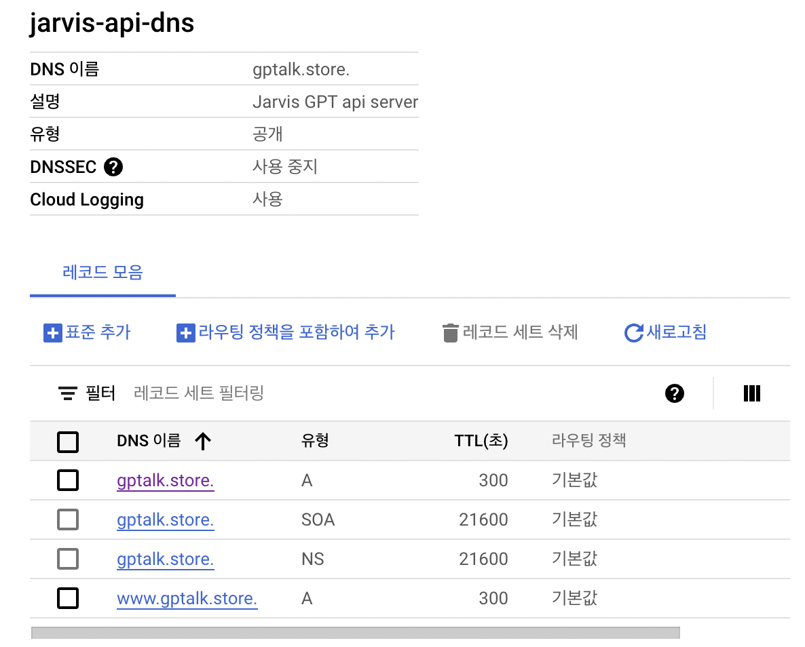

# `jarvis`

> "personally, customized bot with langchain and gpt4"


<div align='center'>
<h4>1. Swagger</h4>


<h4>2. Vectorstore redis</h4>


<h4>3. Use case</h4>
</div>


<table width="100%" border="0">
  <tr>    
  <td></td>
  <td></td>
  </tr>
</table>

<div align="center">
    
</div>


1. Infra
    - [x] fastapi serving
    - [x] vector database: FAISS to [milvus](https://milvus.io/)
        - [x] redis-stack-server
        - [ ] pinecone
    - [x] azure deploy
2. Auth
    - [ ] oauth2 login
    - [ ] manage quota by partner_uuid
3. Domain
    - [x] CRUD `/room`
    - [x] Web socket chat
    - [ ] Payment
4. Etc
    - [x] dotenv python
    - [x] manage chatGPT credit issue (429)
    - [x] nginx ssl with let's encrypt (auto renewal by 3month)
    - [x] deploy on azure
5. Todo
    - kakao callback
    - prompt template
    - issue handling
    - logger monitoring

## init

```sh
$ poetry init
$ poetry env use python3.8
$ poetry add langchain faiss-cpu
```

- vscode setting

```sh
$ poetry config virtualenvs.in-project true
$ poetry config virtualenvs.path "./.venv"
```

## local

```sh
$ make up
```

## deploy with azure vm


```sh
$ make prod-down && make deploy
```

## ssh

```sh
$ make ssh
```


## refs
- [wss](https://github.com/tiangolo/fastapi/issues/3008#issuecomment-1031293342)


## deploy with Google Cloud vm
> https://lemontia.tistory.com/1074

1. pre-install: gcloud-cli: https://cloud.google.com/sdk/docs/install?hl=en
2. run script to deploy vm

```bash
$ ./deploy_gcp_vm.sh tidy-amplifier-387210 asia-northeast3-a e2-standard-4 jarvis-ins
```

3. [Set google cloud dns, fixed IP](https://cloud.google.com/dns/docs/zones?hl=ko&_gl=1*1hbu6r9*_ga*MTk3NjgxMjk4LjE2ODQ2Njg5Mzc.*_ga_WH2QY8WWF5*MTY4NDczNzIyNC4yLjEuMTY4NDc0MjI3OC4wLjAuMA..&_ga=2.9878517.-197681298.1684668937)
    - 
4. Set Nameserver and Set IP
    - (i.g [가비아](https://customer.gabia.com/manual/domain/286/991))
5. `./init_vm.sh`
6. ./data/nginx/app.conf의 https 파트 주석 처리 (lets encrypt 스크립트로 pem 만들기 위해서)
    - [만약 주석처리하지 않는 경우, nginx가 ssl을 찾지 못해 실행되지 않아, `connection refused error`가 발생한다.](https://stackoverflow.com/questions/68449947/certbot-failing-acme-challenge-connection-refused)
7. ./init-letsencrypt.sh
8. ./data/nginx/app.conf 원래대로 수정
9.  vim .env && make deploy 
